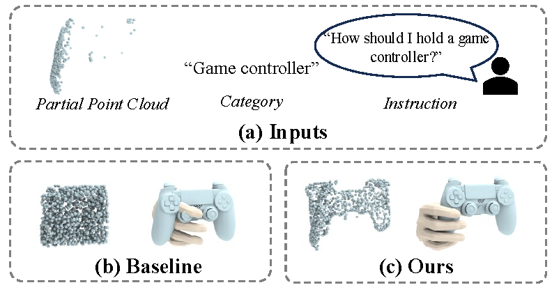

# TOSC: Task-Oriented Shape Completion for Open-World Dexterous Grasp Generation from Partial Point Clouds

Weishang Wu, Yifei Shi, Zhiping Cai

This repository is the official implementation of paper "TOSC: Task-Oriented Shape Completion for Open-World Dexterous Grasp Generation from Partial Point Clouds".

We introduce TOSC, a novel framework for open-world dexterous grasp generation from partial point clouds. TOSC enables Task-Oriented Shape Completion, a new paradigm that explicitly conditions geometry reconstruction on the downstream manipulation task. In contrast to prior work, TOSC is intrinsically task-aware, prioritizing the completion of functional contact regions over global geometry to achieve robust grasping under severe occlusion.

<div align=center>

</div>


## Abstract

Task-oriented dexterous grasping remains challenging in robotic manipulations of open-world objects under severe partial observation, where significant missing data invalidates generic shape completion. In this paper, to overcome this limitation, we study Task-Oriented Shape Completion, a new task that focuses on completing the potential contact regions rather than the entire shape. We argue that shape completion for grasping should be explicitly guided by the downstream manipulation task. To achieve this, we first generate multiple task-oriented shape completion candidates by leveraging the zero-shot capabilities of object functional understanding from several pre-trained foundation models. A 3D discriminative autoencoder is then proposed to evaluate the plausibility of each generated candidate and optimize the most plausible one from a global perspective. A conditional flow-matching model named FlowGrasp is developed to generate task-oriented dexterous grasps from the optimized shape. Our method achieves state-of-the-art performance in task-oriented dexterous grasping and task-oriented shape completion, improving the Grasp Displacement and the Chamfer Distance over the state-of-the-art by $16.17\%$ and $55.26\%$, respectively. In particular, it shows good capabilities in grasping objects with severe missing data. It also demonstrates good generality in handling open-set categories and tasks. 

## News

- [ 2026.01 ] We release the code for grasp generation!

## Setup

1. Create a new `conda` environemnt and activate it.

    ```bash
    conda create -n 3d python=3.8
    conda activate tosc
    ```

2. Install dependent libraries with `pip`.

    ```bash
    pip install -r pre-requirements.txt
    pip install -r requirements.txt
    ```

    - We use `pytorch1.11` and `cuda11.3`, modify `pre-requirements.txt` to install [other versions](https://pytorch.org/get-started/previous-versions/) of `pytorch`.

3. Install [Isaac Gym](https://developer.nvidia.com/isaac-gym) and install [pointnet2](https://github.com/daveredrum/Pointnet2.ScanNet) by executing the following command.

    ```bash
    pip install git+https://github.com/daveredrum/Pointnet2.ScanNet.git#subdirectory=pointnet2
    ```
    More dependencies and  instructions can be found in the [instructions](./thirdparty/README.md).

4. Get MANO asset
    Get the MANO hand model mano_v1_2.zip from the [MANO website](https://mano.is.tue.mpg.de/).

    1) click Download on the top menu, this requires register & login.
    2) on the Download page, navigate to Models & Code section, and click Models & Code.

    Unzip mano_v1_2.zip and copy it into the assets folder.
## Data 


You can process the data by yourself following the [instructions](./preprocessing/README.md).


## Train

    bash scripts/TOSC/train.sh ${EXP_NAME}
    
    
    

## Test (Quantitative Evaluation)

```bash
bash scripts/TOSC/test.sh ${CKPT} 
```


### Sample (Qualitative Visualization)

```bash
bash scripts/TOSC/sample.sh ${CKPT} 
```


## Acknowledgments

Some codes are borrowed from [stable-diffusion](https://github.com/CompVis/stable-diffusion), [PSI-release](https://github.com/yz-cnsdqz/PSI-release), [Pointnet2.ScanNet](https://github.com/daveredrum/Pointnet2.ScanNet), [point-transformer](https://github.com/POSTECH-CVLab/point-transformer), [diffuser](https://github.com/jannerm/diffuser), [Scene-diffuser](https://github.com/scenediffuser/Scene-Diffuser), and [occo](https://github.com/hansen7/OcCo).
